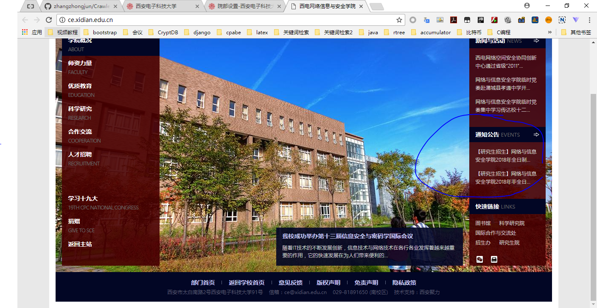
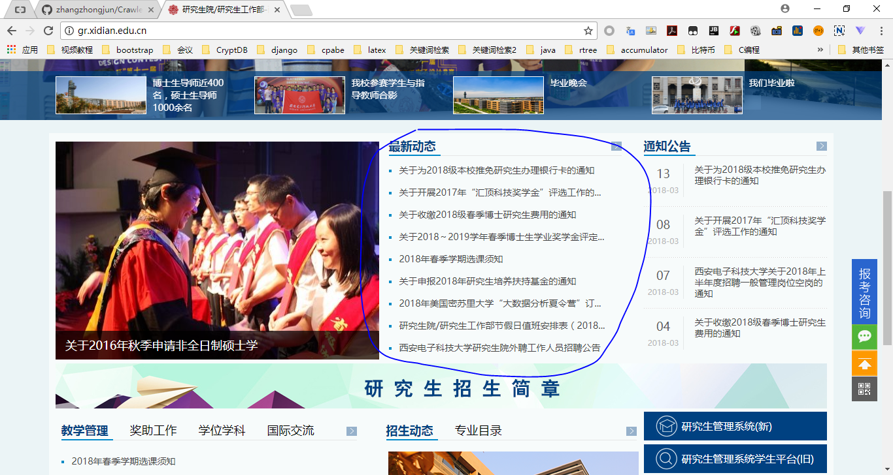
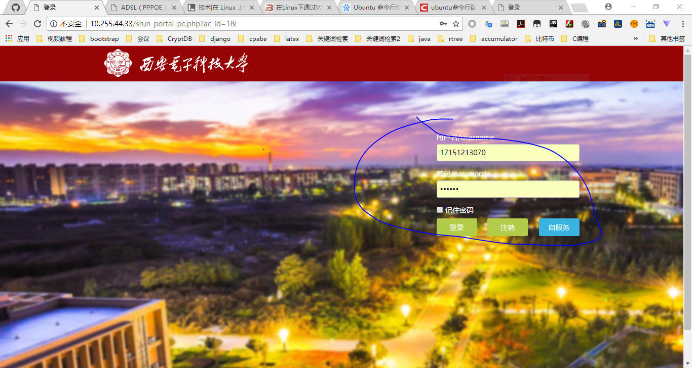

# 西电一些通知的监督

其初心是监视西电某些网页上的更新内容

## xidian-wxy
西电网信院的通知公告


## xidian-yjsy
西电研究生院的通知公告


## xidian-wangluo
通过浏览器登录西电的isp。
初衷是想远程使得ubuntu电脑拨号连接，但是查了半天没有查出拨号连接的命令，只能拾起老本行，使用爬虫登录
另外附上windows下拨号的方法
```cmd
rasdial 宽带连接 你的学号 密码
```
